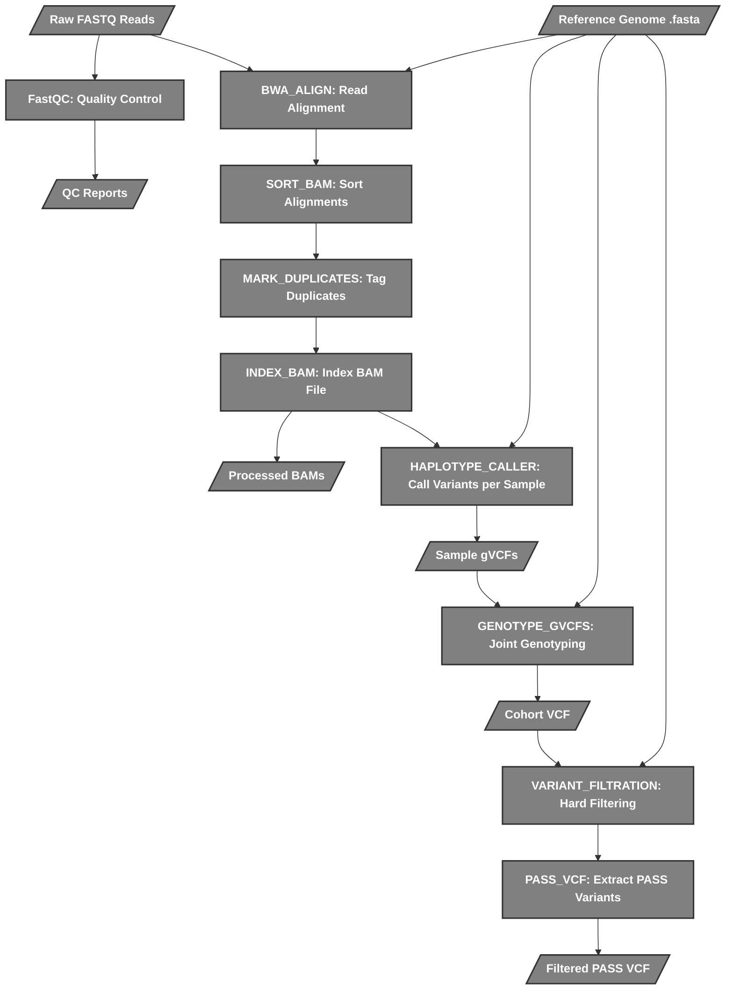
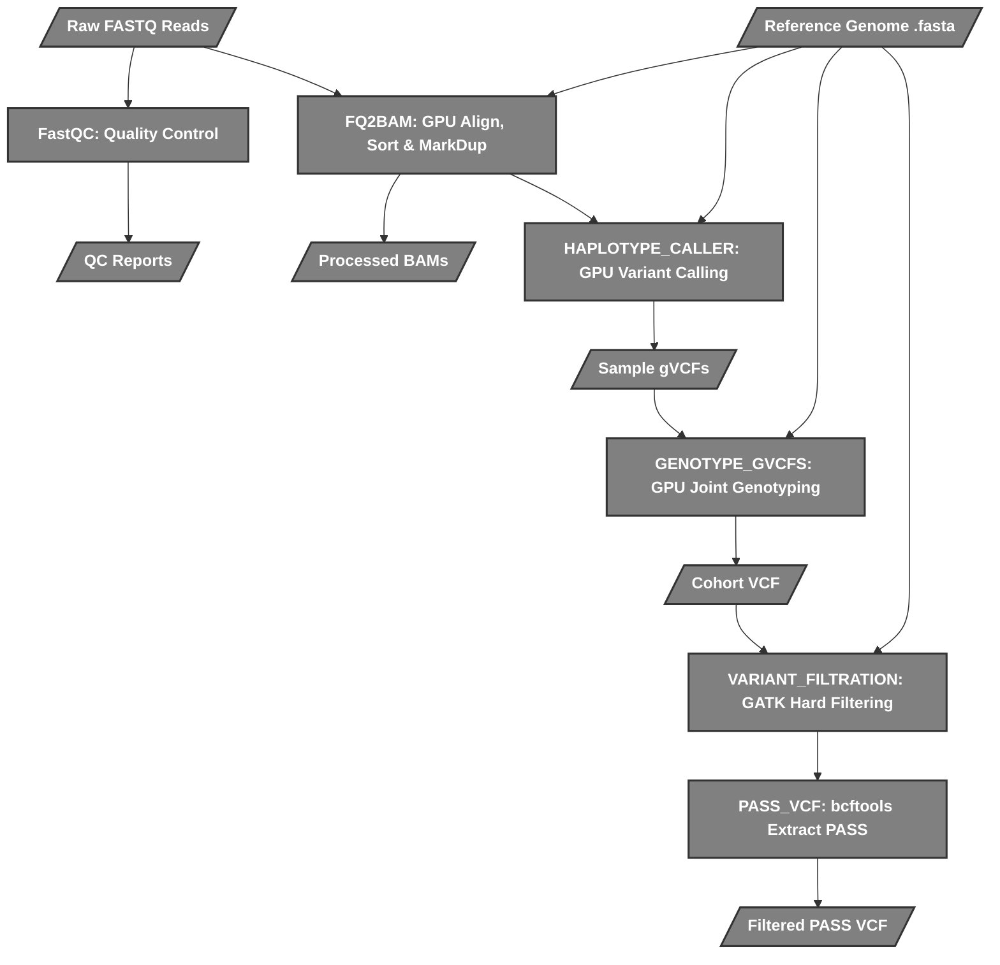
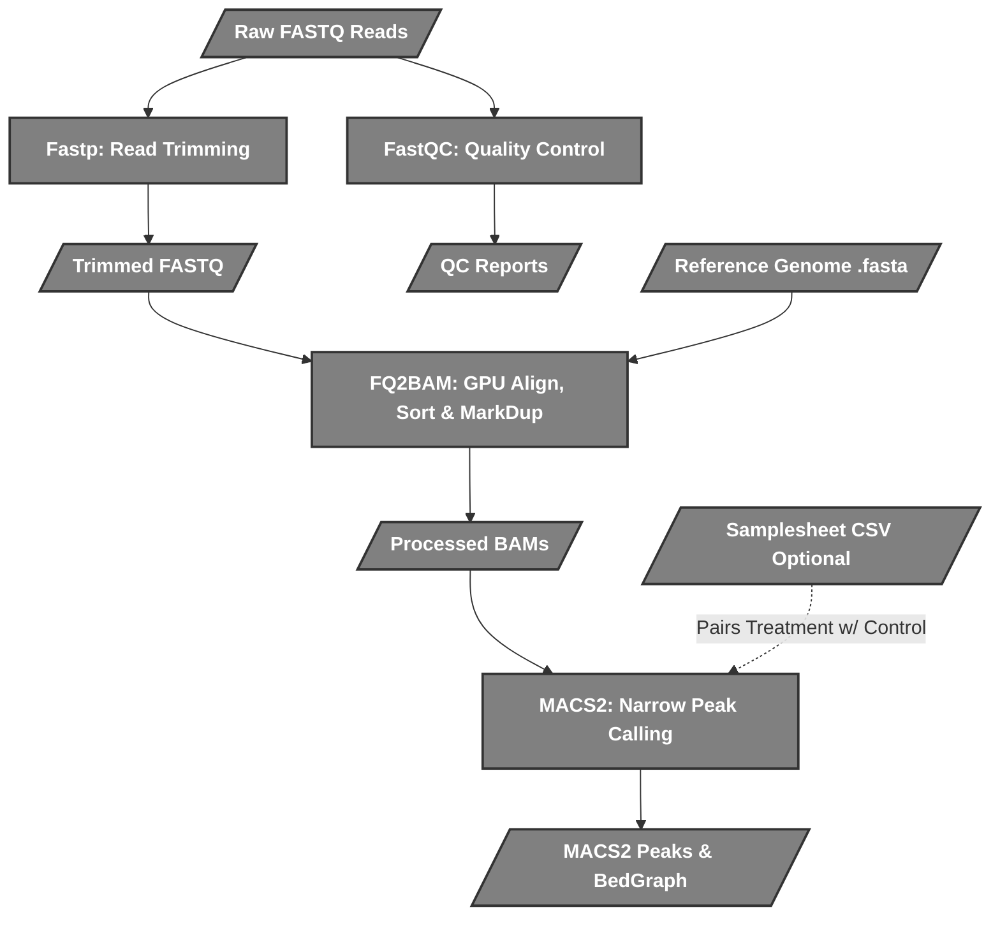
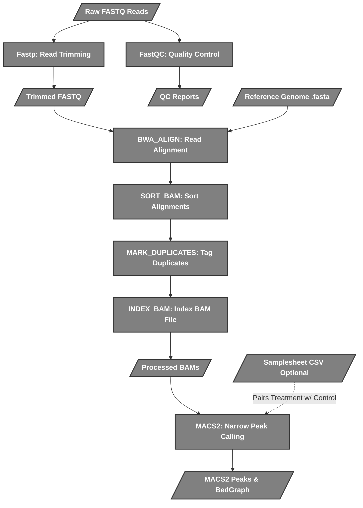
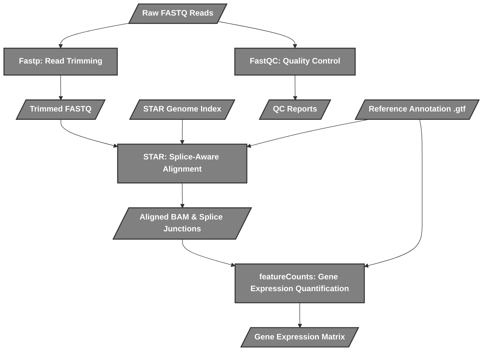
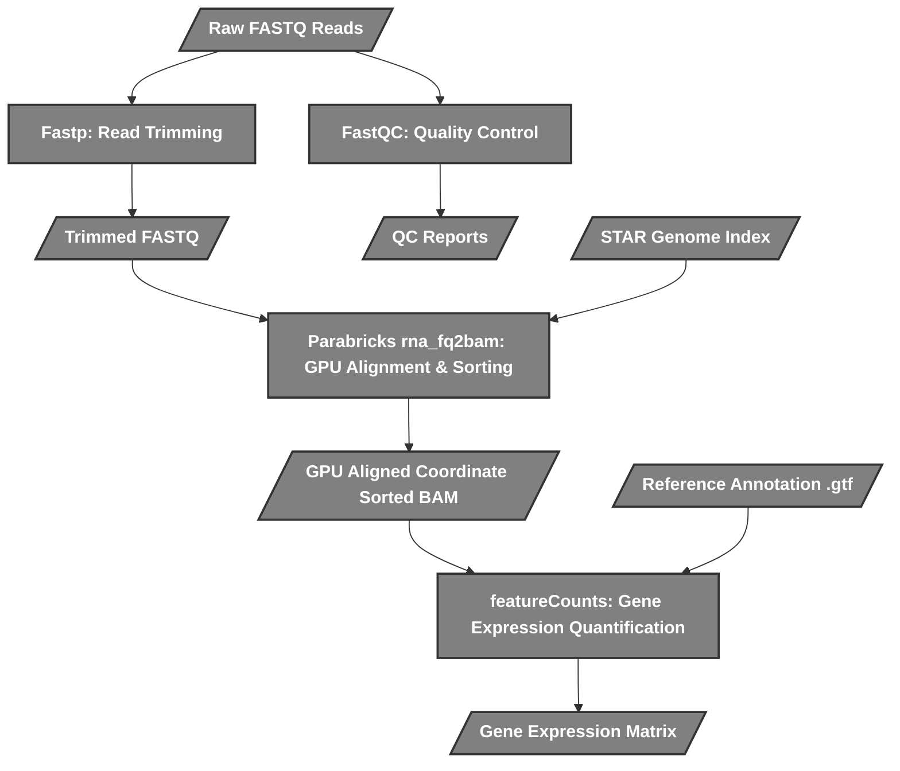
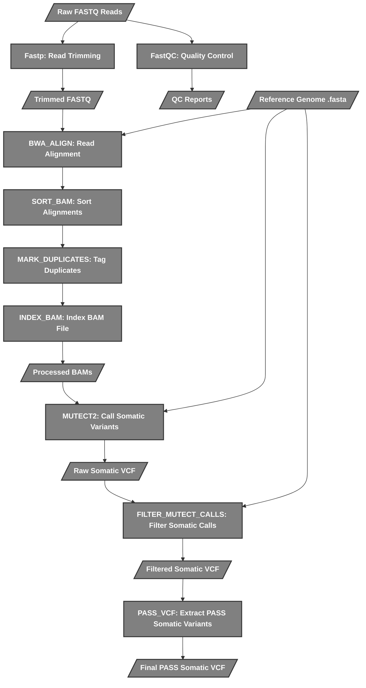
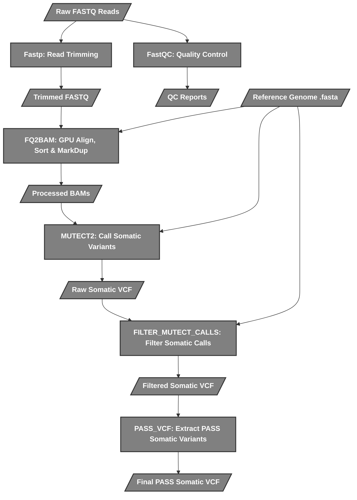
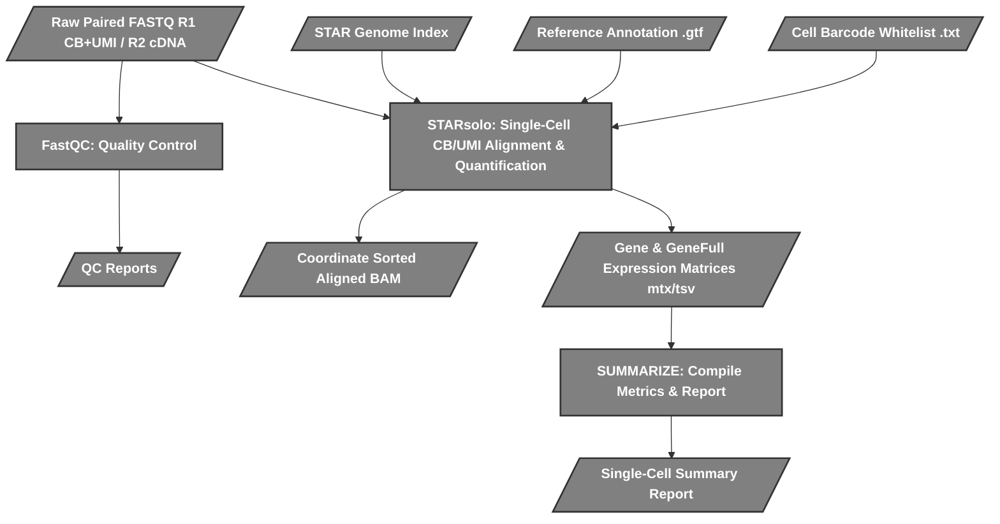

[README.md](https://github.com/user-attachments/files/29699484/README.md)
Developed by Aryan Danny, BITS summer intern under the guidance of Dr. Akash Ranjan, CDFD

### This app runs only on linux and requires docker, It can also be run on windows+wsl+docker desktop but will be slower

# Nextflow Genomics Suite

**Project made in BRIC-CDFD under the guidance of Dr. Akash Ranjan in the Laboratory of Computational & Functional Genomics.**

This repository contains an end-to-end framework for Next-Generation Sequencing data analysis, featuring **Germline Variant Calling**, **ChIP-seq Peak Calling**, and **RNA-seq Expression Quantification** pipelines. It provides **GPU-accelerated** options (via NVIDIA Parabricks) and equivalent **CPU-based** fallbacks (via BWA, GATK4, STAR, MACS2, and featureCounts).

Pipelines:
1. **Germline GPU**: FastQC → fastp → Parabricks fq2bam → Parabricks DeepVariant (or HaplotypeCaller) -> Joint Genotyping -> Variant Filtration.
2. **Germline CPU**: FastQC → fastp → BWA mem → GATK MarkDuplicates → HaplotypeCaller -> CombineGVCFs -> Joint Genotyping -> Variant Filtration.
3. **ChIP-seq GPU**: FastQC → fastp → Parabricks fq2bam → MACS2.
4. **ChIP-seq CPU**: FastQC → fastp → BWA mem → GATK MarkDuplicates → MACS2.
5. **RNA-seq GPU**: FastQC → fastp → Parabricks rna_fq2bam → featureCounts.
6. **RNA-seq CPU**: FastQC → fastp → STAR → featureCounts.
7. **Somatic GPU**: FastQC → fastp → Parabricks fq2bam → GATK Mutect2 → FilterMutectCalls.
8. **Somatic CPU**: FastQC → fastp → BWA mem → GATK Mutect2 → FilterMutectCalls.
9. **scRNA-seq CPU**: FastQC → STARsolo → Summarize.

---

## 🖥️ Graphical User Interface (GUI)

The primary way to interact with the pipelines is through the modern PySide6 desktop application (`interface/gui.py`). 

### Features
- **Unified Pipeline Tabs**: Dedicated tabs named cleanly by pipeline (Germline, ChIP-seq, RNA-seq, Somatic, scRNA-seq) with a built-in checkbox toggle to switch between CPU and GPU acceleration.
- **Auto GPU Detection**: The GUI automatically detects if your system has a compatible NVIDIA GPU with >=12GB VRAM. If no GPU is detected or VRAM is under 12GB, the GPU option is automatically disabled and safely falls back to CPU execution.
- **Auto-Open Results**: Upon successful pipeline completion, the GUI prompts you to automatically pop open the native file explorer to exactly where your BAMs, VCFs, and reports were saved.
- **Descriptive Error Popups**: The GUI actively parses the Nextflow backend logs. If a failure occurs (e.g., Docker disconnected, out of memory, no space left, missing indices), it presents a clear, actionable popup window explaining exactly how to fix the issue instead of a raw exit code.
- **Resource Monitor & Clamping**: A detached pop-up window tracks live CPU/RAM usage. All underlying shell scripts dynamically "clamp" max thread and RAM usage based on your actual system hardware to prevent Out of Memory (OOM) crashes across different devices.
- **Low Memory Mode**: A built-in toggle for NVIDIA Parabricks pipelines to optimize memory usage on supported GPUs.
- **Pre-built Indexing**: 1-click BWA reference index building directly from the GUI.

To run the GUI:
```bash
# Activate the virtual environment first
source .venv/bin/activate
python interface/gui.py
```

---

## 📂 Input Requirements

To successfully run any of the pipelines, you must provide the following inputs in specific formats:

### 1. FASTQ Files
- **Format**: Reads must be **paired-end** (with robust paired-end fallback validation in RNA-seq) and **gzipped** (`.fastq.gz`).
- **Naming Convention**: Files must be named strictly matching `*_R1.fastq.gz` and `*_R2.fastq.gz`, where the prefix before `_R1` or `_R2` exactly matches the sample's name.
  - *Correct*: `sampleA_R1.fastq.gz`, `sampleA_R2.fastq.gz`
  - *Incorrect*: `sampleA_1.fq.gz`, `sampleA_R1_001.fastq.gz` (rename these to the required format).
- **Directory**: Place all your raw reads in a single directory to be selected in the GUI or CLI.

### 2. Reference Genome
- **Format**: You must provide a reference genome in FASTA format (`.fa` or `.fasta`).
- **Indices**: The pipelines require multiple reference indices (e.g., BWA `.bwt`, Samtools `.fai`, GATK `.dict`, STAR genome index). 
  - If these are missing, the pipeline will automatically attempt to build them using Docker before running.
  - **Tip**: Building indices can take a long time. It is highly recommended to use the "Build Reference Index" button in the GUI once per new reference genome.

### 3. Samplesheet (ChIP-seq Only)
- **Format**: A comma-separated values (`.csv`) file named `samplesheet.csv`.
- **Purpose**: Required only if you want to map treatment samples against specific control/Input samples for `MACS2` peak calling.
- **Structure**: Must contain a header with exactly `sample,fastq_1,fastq_2,control`.
  - Example:
    ```csv
    sample,fastq_1,fastq_2,control
    treat_1,treat_1_R1.fastq.gz,treat_1_R2.fastq.gz,input_1
    input_1,input_1_R1.fastq.gz,input_1_R2.fastq.gz,
    ```
- **Note**: If no samplesheet is provided, the ChIP-seq pipelines will default to running peak calling without a matched control.

---

## 🗺️ System Map & Script Interactions

```mermaid
graph TD
    User([User])

    subgraph "Setup & Maintenance"
        install[install.sh]
        cleanup[cleanup.sh]
    end

    subgraph "GUI Interface"
        gui[gui.py]
    end

    subgraph "Germline CPU Pipeline"
        cpu_run[Germline_CPU_run.sh]
        cpu_nf[Germline_CPU.nf]
        cpu_config[Germline_CPU.config]
    end

    subgraph "Germline GPU Pipeline"
        gpu_run[Germline_pipeline_run.sh]
        gpu_nf[Germline_pipeline.nf]
        gpu_config[Germline_pipeline.config]
    end

    subgraph "ChIP-seq CPU Pipeline"
        chip_cpu_run[CHIPseq_CPU_run.sh]
        chip_cpu_nf[CHIPseq_CPU.nf]
        chip_cpu_config[CHIPseq_CPU.config]
    end

    subgraph "ChIP-seq GPU Pipeline"
        chip_run[CHIPseq_GPU_run.sh]
        chip_nf[CHIPseq_GPU.nf]
        chip_config[CHIPseq_GPU.config]
    end

    subgraph "RNA-seq CPU Pipeline"
        rna_cpu_run[RNAseq_CPU_run.sh]
        rna_cpu_nf[RNAseq_CPU.nf]
        rna_cpu_config[RNAseq_CPU.config]
    end

    subgraph "RNA-seq GPU Pipeline"
        rna_gpu_run[RNAseq_GPU_run.sh]
        rna_gpu_nf[RNAseq_GPU.nf]
        rna_gpu_config[RNAseq_GPU.config]
    end

    subgraph "Somatic CPU Pipeline"
        som_cpu_run[Somatic_CPU_run.sh]
        som_cpu_nf[Somatic_CPU.nf]
        som_cpu_config[Somatic_CPU.config]
    end

    subgraph "Somatic GPU Pipeline"
        som_gpu_run[Somatic_GPU_run.sh]
        som_gpu_nf[Somatic_GPU.nf]
        som_gpu_config[Somatic_GPU.config]
    end

    subgraph "scRNA-seq CPU Pipeline"
        scrna_cpu_run[scRNAseq_CPU_run.sh]
        scrna_cpu_nf[scRNAseq_CPU.nf]
        scrna_cpu_config[scRNAseq_CPU.config]
    end

    %% User interactions
    User -->|Runs| install
    User -->|Runs| cleanup
    User -->|Runs| gui
    
    User -->|Or Runs| cpu_run
    User -->|Or Runs| gpu_run
    User -->|Or Runs| chip_run
    User -->|Or Runs| chip_cpu_run
    User -->|Or Runs| rna_cpu_run
    User -->|Or Runs| rna_gpu_run
    User -->|Or Runs| som_cpu_run
    User -->|Or Runs| som_gpu_run
    User -->|Or Runs| scrna_cpu_run

    %% GUI invoking run scripts
    gui -->|Invokes| cpu_run
    gui -->|Invokes| gpu_run
    gui -->|Invokes| chip_run
    gui -->|Invokes| chip_cpu_run
    gui -->|Invokes| rna_cpu_run
    gui -->|Invokes| rna_gpu_run
    gui -->|Invokes| som_cpu_run
    gui -->|Invokes| som_gpu_run
    gui -->|Invokes| scrna_cpu_run

    %% Run scripts executing NF
    cpu_run -->|Executes| cpu_nf
    gpu_run -->|Executes| gpu_nf
    chip_run -->|Executes| chip_nf
    chip_cpu_run -->|Executes| chip_cpu_nf
    rna_cpu_run -->|Executes| rna_cpu_nf
    rna_gpu_run -->|Executes| rna_gpu_nf
    som_cpu_run -->|Executes| som_cpu_nf
    som_gpu_run -->|Executes| som_gpu_nf
    scrna_cpu_run -->|Executes| scrna_cpu_nf

    %% NF using Config
    cpu_nf -.->|Uses| cpu_config
    gpu_nf -.->|Uses| gpu_config
    chip_nf -.->|Uses| chip_config
    chip_cpu_nf -.->|Uses| chip_cpu_config
    rna_cpu_nf -.->|Uses| rna_cpu_config
    rna_gpu_nf -.->|Uses| rna_gpu_config
    som_cpu_nf -.->|Uses| som_cpu_config
    som_gpu_nf -.->|Uses| som_gpu_config
    scrna_cpu_nf -.->|Uses| scrna_cpu_config

    %% Styling
    classDef default fill:#808080,stroke:#333,stroke-width:2px,color:#ffffff,font-weight:bold;
    classDef script fill:#808080,stroke:#333,stroke-width:2px,color:#ffffff,font-weight:bold;
    classDef nf fill:#808080,stroke:#333,stroke-width:2px,color:#ffffff,font-weight:bold;
    
    class install,cleanup,gui,cpu_run,gpu_run,chip_run,chip_cpu_run,rna_cpu_run,rna_gpu_run,som_cpu_run,som_gpu_run,scrna_cpu_run script;
    class cpu_nf,gpu_nf,chip_nf,chip_cpu_nf,rna_cpu_nf,rna_gpu_nf,som_cpu_nf,som_gpu_nf,scrna_cpu_nf,cpu_config,gpu_config,chip_config,chip_cpu_config,rna_cpu_config,rna_gpu_config,som_cpu_config,som_gpu_config,scrna_cpu_config nf;
```



---

## 📁 Project Structure

```text
Nextflow/
├── README.md                 # Project documentation
├── install.sh                # Installation script
├── cleanup.sh                # Cleanup utility script
├── Data/                     # Default data directory
│   ├── Raw/                  # FastQ files go here
│   └── Ref/                  # Reference genomes go here
├── interface/                # Graphical Interfaces
│   ├── gui.py                # PySide6 Desktop GUI
│   └── requirements.txt      # GUI Python dependencies
├── pipeline_images/          # Preinstalled research flowchart images
├── pipelines/                
│   ├── germline_cpu/         # CPU Germline pipeline (BWA/GATK)
│   ├── germline_gpu/         # GPU Germline pipeline (Parabricks fq2bam/DeepVariant)
│   ├── chipseq/              # GPU ChIP-seq peak calling (fq2bam/MACS2)
│   ├── chipseq_cpu/          # CPU ChIP-seq peak calling (BWA/MACS2)
│   ├── rnaseq_cpu/           # CPU RNA-seq expression (STAR/featureCounts)
│   ├── rnaseq_gpu/           # GPU RNA-seq expression (Parabricks rna_fq2bam/featureCounts)
│   ├── somatic_cpu/          # CPU Somatic Variant Calling (BWA/Mutect2)
│   ├── somatic_gpu/          # GPU Somatic Variant Calling (Parabricks/Mutect2)
│   └── scrnaseq_cpu/         # CPU Single-cell RNA-seq (STARsolo)
├── results/                  # Pipeline outputs (BAMs, VCFs, Peaks, Counts)
└── work/                     # Nextflow intermediate working directory
```

### Detailed Script Lifecycle

When you trigger a pipeline run, the scripts interact in a specific, layered sequence to move from a graphical button click down to a containerized process:

1. **The Interface Layer (`gui.py`)**
   - **Role:** Captures user inputs (paths, names) and translates graphical slider values into strict environment variables (e.g., `MAX_CPUS`, `MAX_MEM_GB`, `LOW_MEMORY`).
   - **Action:** Spawns a background subprocess that executes the bash runner script for the selected pipeline.

2. **The Runner Layer (`*_run.sh`)**
   - **Role:** The bridge between your host operating system and Nextflow/Docker.
   - **Action:** 
     - Parses the environment variables passed down by the GUI.
     - Calculates dynamic resource allocations (e.g., preventing FastQC from requesting more memory than available).
     - Constructs the `docker run` command, mapping user directories into the containers.
     - Kicks off the Nextflow executable.

3. **The Orchestrator Layer (`*.nf` & `*.config`)**
   - **Role:** Nextflow's domain. The `.nf` file defines the pipeline logic, and the `.config` defines the default resource profiles.
   - **Action:** Nextflow reads the `.nf` file to understand the dependency graph. It dynamically creates isolated, hashed `work/` directories for every single process to prevent data collisions.

4. **The Execution Layer (Inside the Containers)**
   - **Role:** The actual bioinformatics tools (Parabricks, BWA, GATK, STAR, MACS2, featureCounts).
   - **Action:** Nextflow mounts the specific `work/` directory into an isolated Docker container. Tools run, generate output, and Nextflow moves the final data to the `results/` folder upon completion.

---

## ⚙️ Pipeline Flowcharts

These flowcharts break down exactly what each Nextflow script (`.nf`) does under the hood.

### 1. Germline CPU Pipeline (`Germline_CPU.nf`)
Utilizes traditional CPU tools: **FastQC**, **BWA**, and **GATK 4**.



### 2. Germline GPU Pipeline (`Germline_pipeline.nf`)
Utilizes **NVIDIA Clara Parabricks** to significantly accelerate standard steps.



### 3. ChIP-seq GPU Pipeline (`CHIPseq_GPU.nf`)
Utilizes **Fastp** for trimming, **NVIDIA Parabricks fq2bam** for alignment, and **MACS2** for peak calling. Supports Input DNA controls via a `samplesheet.csv`.



### 4. ChIP-seq CPU Pipeline (`CHIPseq_CPU.nf`)
Utilizes **Fastp** for read trimming, **BWA mem** for CPU alignment, **GATK MarkDuplicates**, and **MACS2** for peak calling. Supports Input DNA controls via a `samplesheet.csv`.



### 5. RNA-seq CPU Pipeline (`RNAseq_CPU.nf`)
Utilizes **Fastp** for quality trimming, **STAR** for splice-aware alignment against an indexed reference genome, and **featureCounts** for gene-level expression quantification.



### 6. RNA-seq GPU Pipeline (`RNAseq_GPU.nf`)
Utilizes **NVIDIA Parabricks rna_fq2bam** for GPU-accelerated RNA-seq alignment and sorting, followed by **featureCounts** for expression quantification.



### 7. Somatic CPU Pipeline (`Somatic_CPU.nf`)
Utilizes **BWA mem** and **GATK MarkDuplicates** for read processing, followed by **GATK Mutect2** and **FilterMutectCalls** for somatic variant calling in tumor-only or tumor-normal modes.



### 8. Somatic GPU Pipeline (`Somatic_GPU.nf`)
Utilizes **NVIDIA Parabricks fq2bam** for GPU-accelerated alignment, sorting, and duplicate marking, followed by **GATK Mutect2** for somatic variant calling.



### 9. scRNA-seq CPU Pipeline (`scRNAseq_CPU.nf`)
Utilizes **STARsolo** for single-cell RNA-seq alignment, Cell Barcode / UMI extraction, error correction, and gene/gene-full expression matrix generation.



---

## 📦 Installation on a New System

To deploy this application on a completely new system:

1. **Clone the repository** (or download and extract the project files):
   ```bash
   git clone <repository_url>
   cd NGS-nextflow
   ```

2. **Run the global installation script**:
   ```bash
   ./install.sh
   ```
   This script will automatically:
   - Create the necessary directory structure (`Data/Raw`, `Data/Ref`, `results`, `work`, `logs`).
   - Make all pipeline scripts executable.
   - Create a Python virtual environment (`.venv`) and install the required GUI dependencies (`PySide6`, `psutil`).
   - Pull the required Docker container images (if Docker is installed and running).

3. **Verify Host Requirements**:
   - For GUI: Python 3.8+ (Dependencies automatically handled by `.venv`).
   - For Pipeline Execution: **Docker** must be installed and running. If on an enterprise cluster without Docker, use **Singularity/Apptainer** (HPC Mode).
   - If on Windows, ensure **WSL2** (Windows Subsystem for Linux) is installed and you are running within the Linux environment.

4. **Launch the GUI**:
   ```bash
   source .venv/bin/activate
   python interface/gui.py
   ```

---

## 🚀 How to Run Manually (Without GUI)

If you prefer the terminal, you can execute the runner scripts directly.

1. **Install dependencies**:
   ```bash
   ./install.sh
   ```

2. **Execute a Pipeline**:
   ```bash
   export REF_DIR="/path/to/reference"
   export RESULTS_DIR="/path/to/results"
   
   # Germline CPU
   bash pipelines/germline_cpu/Germline_CPU_run.sh <cohort_name> <path_to_fastqs>

   # Germline GPU
   bash pipelines/germline_gpu/Germline_pipeline_run.sh <cohort_name> <path_to_fastqs>
   
   # ChIP-seq CPU
   bash pipelines/chipseq_cpu/CHIPseq_CPU_run.sh <project_name> <path_to_fastqs> <path_to_samplesheet_optional>

   # ChIP-seq GPU
   bash pipelines/chipseq/CHIPseq_GPU_run.sh <project_name> <path_to_fastqs> <path_to_samplesheet_optional>

   # RNA-seq CPU
   bash pipelines/rnaseq_cpu/RNAseq_CPU_run.sh <project_name> <path_to_fastqs>

   # RNA-seq GPU
   bash pipelines/rnaseq_gpu/RNAseq_GPU_run.sh <project_name> <path_to_fastqs>
   ```

3. **Cleanup**:
   ```bash
   ./cleanup.sh
   ```

## 🐋 Singularity / HPC Mode (Docker-less)
If you are running on an Enterprise cluster or a Linux system where Docker is not available, you can use the interactive Singularity wrapper. This completely bypasses Docker and runs Nextflow and the Parabricks `.sif` containers natively.

```bash
# Make the wrapper executable
chmod +x run_singularity.sh

# Run the interactive wrapper
./run_singularity.sh
```
The script will automatically check for Singularity, download Nextflow if missing, and ask you which pipeline you'd like to run.

---

## 🧪 Verification & Benchmarking Results

All 9 pipelines in the suite have been rigorously tested and verified across both CPU and GPU execution environments using standardized genomics datasets (e.g., NA12878 exome subsets and 10x Chromium single-cell libraries).

### 📊 Suite Validation Status

| Pipeline | Modality | Status | Key Process Workflows Verified |
| :--- | :---: | :---: | :--- |
| **Germline CPU** | CPU | **PASSED** | FastQC → fastp → BWA mem → GATK MarkDuplicates → HaplotypeCaller → GenotypeGVCFs |
| **Germline GPU** | GPU (Parabricks) | **PASSED** | Parabricks `fq2bam` accelerated alignment & duplicate marking → DeepVariant / HaplotypeCaller |
| **ChIP-seq CPU** | CPU | **PASSED** | FastQC → fastp → BWA mem → GATK MarkDuplicates → BAM Indexing → MACS2 Peak Calling |
| **ChIP-seq GPU** | GPU (Parabricks) | **PASSED** | FastQC → fastp → Parabricks accelerated `fq2bam` → MACS2 Peak Calling |
| **RNA-seq CPU** | CPU | **PASSED** | FastQC → fastp → STAR Alignment → featureCounts Gene Quantification |
| **RNA-seq GPU** | GPU (Parabricks) | **PASSED** | FastQC → fastp → Parabricks `rna_fq2bam` → featureCounts Gene Quantification |
| **Somatic CPU** | CPU | **PASSED** | FastQC → fastp → BWA mem → GATK MarkDuplicates → GATK `Mutect2` → FilterMutectCalls |
| **Somatic GPU** | GPU (Parabricks) | **PASSED** | Parabricks accelerated `fq2bam` → GATK `Mutect2` Variant Calling |
| **scRNA-seq CPU** | CPU | **PASSED** | FastQC → STARsolo (CB/UMI extraction, Gene & GeneFull quantification) → Summary Reporting |

### 🛠️ Key Architectural Enhancements & Robustness Features

- **Automated STAR Index Version Alignment**: To eliminate Docker container version incompatibility errors when sharing pre-built STAR indices across CPU (`STAR v2.7.11a/v2.7.4a`) and GPU (`Parabricks v2.7.1a`) pipelines, the pipeline runner scripts automatically sanitize and align `genomeParameters.txt` metadata prior to execution.
- **Variable Read Length Single-Cell Support**: The `scRNA-seq CPU` pipeline incorporates `--soloBarcodeReadLength 0`, disabling strict read-length checks while maintaining precise 16 bp Cell Barcode and 12 bp UMI extraction. This prevents fatal termination when processing trimmed reads or mixed-length libraries.
- **Dynamic Resource Clamping**: All pipelines dynamically sense available system CPU threads and RAM, automatically adjusting JVM `-Xmx` heap sizes and thread counts to eliminate Out of Memory (OOM) failures across heterogeneous workstations and HPC environments.

